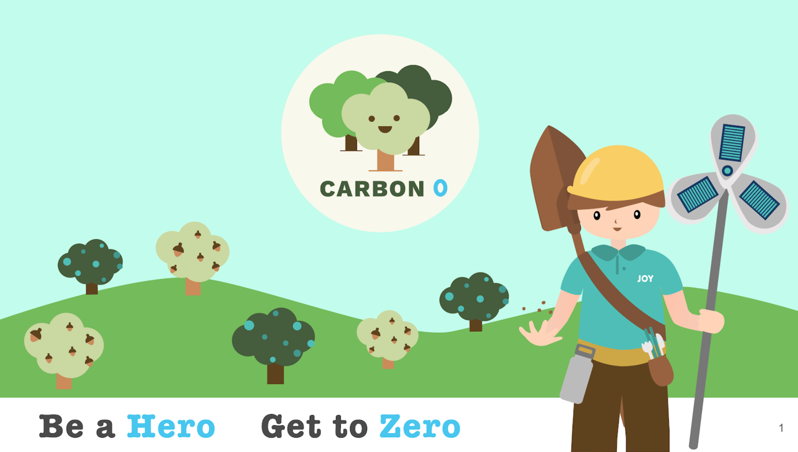

# Carbon0 Games
## ___The game to save the planet!___

- [ ] About This Project
- [ ] Motivation
- [ ] Milestones
- [ ] Tech Stack
- [ ] Contributing
   

## About this Project
800 million people played pokemon go. What if they were playing a different game, a game to reduce their carbon footprint?

This game is called Carbon0!

Carbon0 shows players their impacts using 
AR filters.
It creates connections, communities and economically empowers environmentally-
friendly businesses 
and charities.
All while having fun!
  

## Motivation
Climate change is real, and human beings are playing an active role in deciding what the future of the planet will be. We need to bring as many people as possible to adopt sustainable lifestyle habits, in order to slow (and eventually reverse) the progression of climate change’s worst effects. 

Climate change understandably makes a lot of people afraid, and some have become cynical of humanity changing its ways. However, we see climate change as a challenge that humanity can rise up to solve together. We know we can inspire large-scale change in people’s habits, by having them engage in something we all have experienced since childhood: joy. 

The goal of Carbon0 is to help 10% of the world population (about 800 million people today) create a carbon-negative lifestyle for themselves and their communities by 2030. We will accomplish this by guiding users to easily accessible products or activities that can lower their carbon footprint, and by making it fun to take action for the climate through our web application.

  

## Milestones 
- Create a Landing Page
- Implement Inital User Quiz
- Add Social Sharing Options
- Add User Authentication
  

## Tech Stack
- [Django](https://www.djangoproject.com/) - Main framework for handling backend
- [Python](https://www.python.org) - Primary coding language
- [Github](https://www.github.com) - for Version Control
  

## Contributing
This is a step by step instruction created by our team member __, to allow other to be able to contribute to the project:
> Note! Be sure that you have been added as a contributor to the project before hand, otherwise it will be hard to get past step 3

### __Initial Setup__

1. In the folder of your choice, type `git clone https://github.com/UPstartDeveloper/carbon0-web-app.git` into the terminal
2. Setup the folder as you wish while following these instructions
    - Contact PM Zain for the .env file, and download it into the folder where manage.py is located in the project (please do not share this file)!
    - Create a new db called “carbon0” using this SQL command in your Terminal (and you can [install Postgres.app here](https://postgresapp.com/) if you don’t have it yet): CREATE DATABASE carbon0;
    - Start a new virtual env, and install Django - This [tutorial](https://packaging.python.org/guides/installing-using-pip-and-virtual-environments/) is a good way to start if you need help to install and setup a virtual env
    - From this point on, stay in the virtual env
    - Run `python3 -m pip install -r requirements.txt`
    - Followed by `Do any db migrations that might be needed, using python manage.py migrate`
3. `git checkout -b name_of_your_branch` (this both creates your branch and 'moves'; you to that branch to work on. Make sure that when coding that you are working on your branch. You can see which branch your on in the terminal, depending on your terminal setup with oh-my-zsh. You can also see it in the lower left corner in VSCode and lower right Atom)
    - To travel between branches simply use `git checkout branch_name`
4. code as usual
5. `git push origin name_of_your_branch` (please do not git push origin MASTER) make sure to push to your branch.
6. Occasionally check on other peoples branch as well in github by clicking the branch:master button under the commit count in the repo and you can switch branches and see others branches

### __Running Locally__

1. Make sure all settings are installed and migrations completed, especially after pulling the latest version from master
2. Once you've navigated to the application folder, run the command:

        $ python3 manage.py runserver
        

3. The following will be returned in the command prompt:

        Performing system checks...

        System check identified no issues (0 silenced).

        You have unapplied migrations; your app may not work properly until they are applied.
        Run 'python manage.py migrate' to apply them.

        September 15, 2020 - 15:50:53
        Django version 3.1, using settings 'mysite.settings'
        Starting development server at http://127.0.0.1:8000/
        Quit the server with CONTROL-C.
        

4. You can then enter the url into your browser to navigate to the launched project.
5. (Extra - for faster access) Using `cntrl+click` on  `http://127.0.0.1:8000/` which will open up a menu, from there select the option to navigate to the url.

### __Create Superuser__
#### _Creating superuser for localhost:_

1. Open your terminal and change directory to your project
2. Start the program as you would in the above instructions for running the program locally
3. Once running, use the command `python3 manage.py createsuperuser`
4. From here, you will be prompted for **username**, **email**, **password** (which will need to be entered twice)
5. Once this has been finished, feel free to launch the application, and enter this `http://127.0.0.1:8000/admin/` url.

#### _Creating superuser for hosted site:_

1. Head to the [site]()
2. (Work in Progress) Contact Zain for more details and permissions
  

### __Creating a Pull Request__
When wanting to contribute to the codebase, the following steps are key to ceeping the code clean and functional.

1. On GitHub, navigate to the main page of the repository.
2. In the "Branch" menu, choose the branch that contains your commits.
3. Above the list of files, click  __Pull request__.
4. Use the base branch dropdown menu to select the branch you'd like to merge your changes into, then use the compare branch drop-down menu to choose the topic branch you made your changes in.
5. Type a title and description for your pull request.
6. To create a pull request that is ready for review, click Create Pull Request.

*From [Creating a Pull Request via Github](https://docs.github.com/en/free-pro-team@latest/github/collaborating-with-issues-and-pull-requests/creating-a-pull-request)